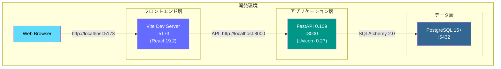
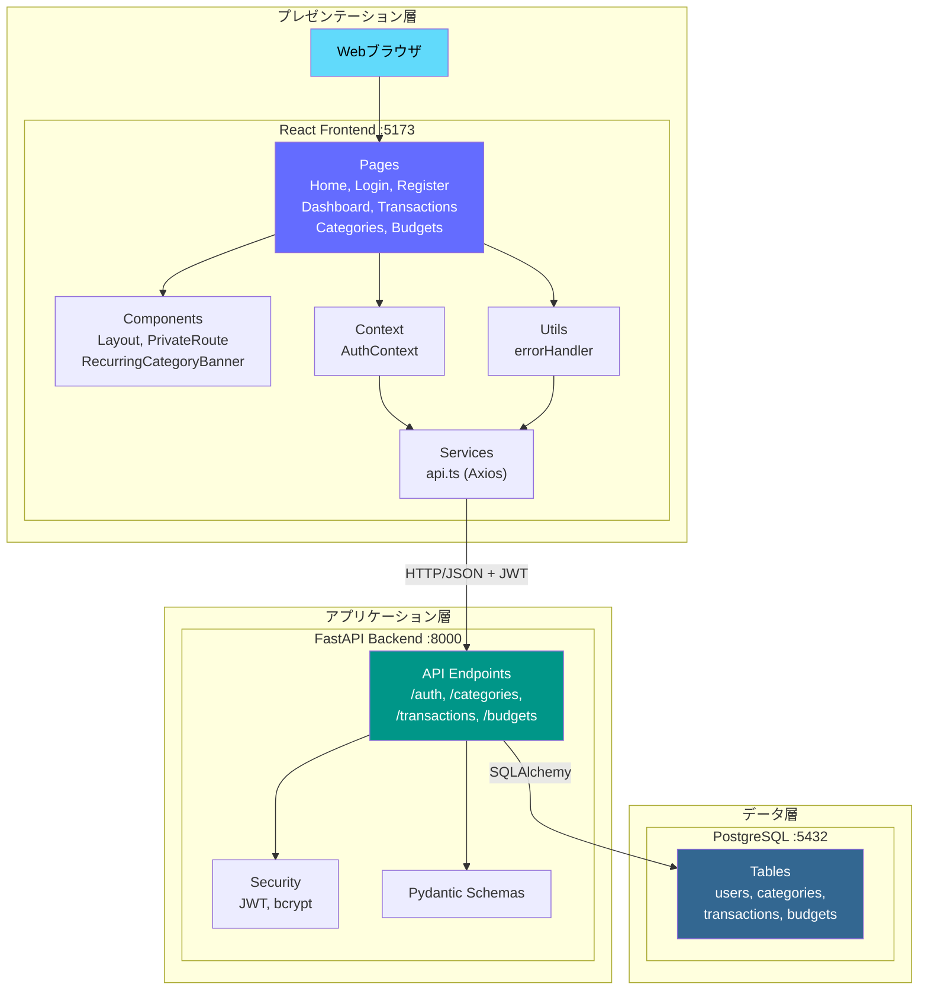
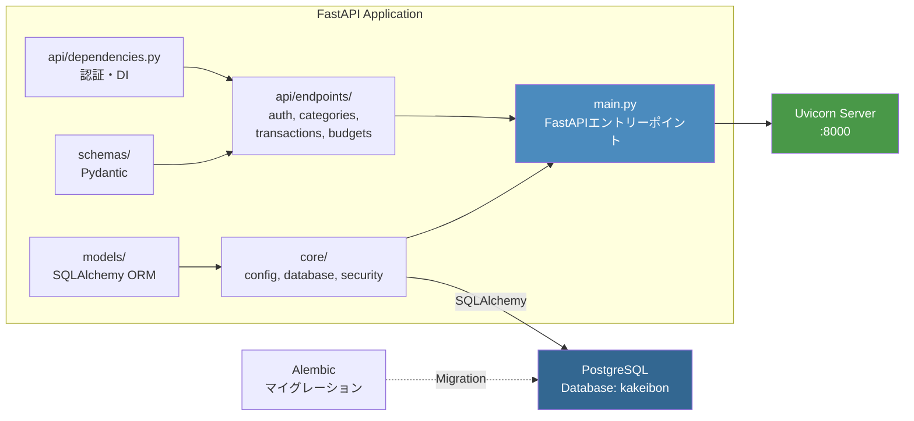
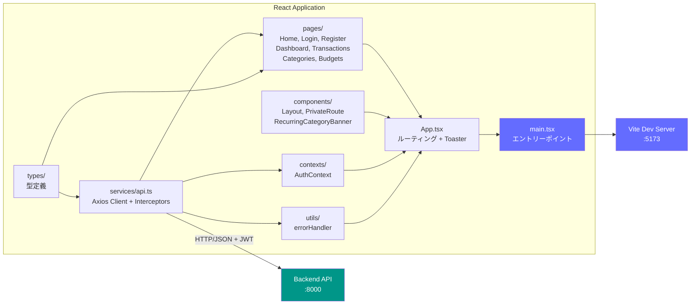
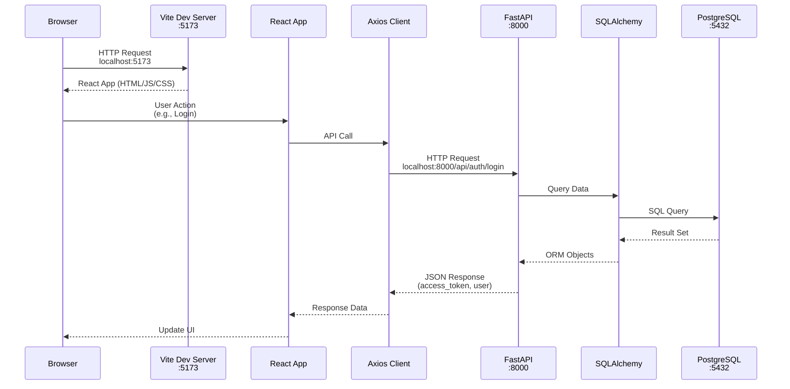
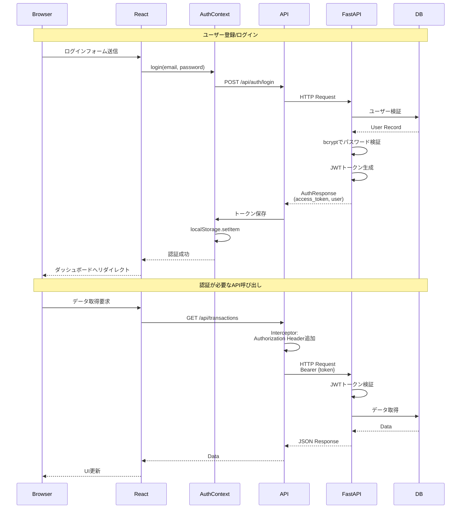
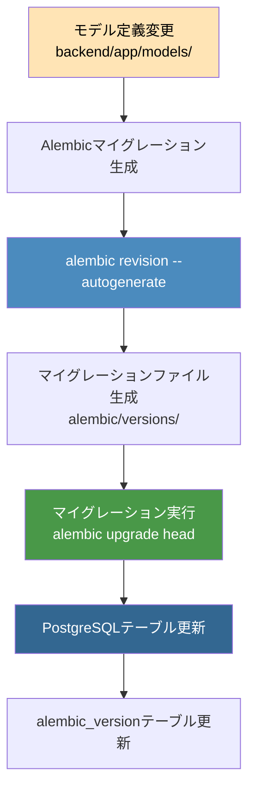
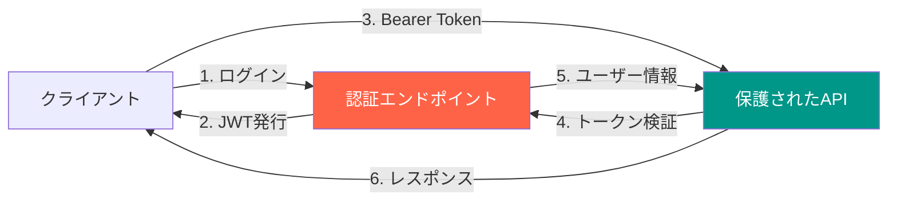
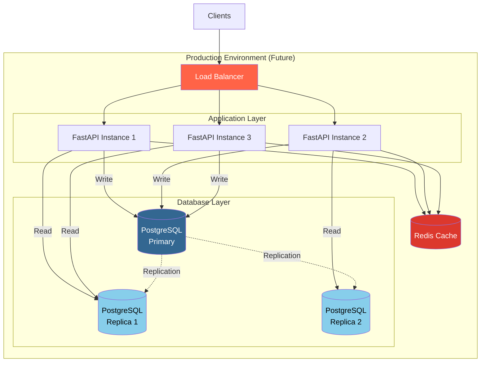

# システムアーキテクチャ

## プロジェクト実装状況

### 実装状態

**状態**: 基本機能実装完了（開発環境構築済み）

**実装済み機能**:
- ユーザー認証（登録・ログイン・JWT認証）
- カテゴリ管理（CRUD）
- 取引管理（CRUD、フィルタリング）
- 予算管理（CRUD、月次管理）
- ダッシュボード（統計表示）
- エラーハンドリング（react-hot-toast）

**未実装機能**:
- ユニットテスト・統合テスト
- CI/CDパイプライン
- 本番環境デプロイ設定
- 統計・レポート機能の拡張
- データエクスポート（CSV, PDF）

## システム全体構成

### 全体構成（3層アーキテクチャ）



### 3層構成の詳細



### アプリケーション構成詳細

#### バックエンド構成



#### フロントエンド構成



### ネットワーク通信フロー



### 認証フロー（JWT）



### データベースマイグレーションフロー



## ポート構成

| サービス | ポート | 用途 |
|---------|-------|------|
| PostgreSQL | 5432 | データベース接続 |
| FastAPI/Uvicorn | 8000 | REST API サーバー |
| Vite Dev Server | 5173 | フロントエンド開発サーバー |

## 接続情報まとめ

### データベース接続

```bash
# ローカル開発環境
Host: localhost
Port: 5432
Database: kakeibon
User: postgres
Password: password

# WSL2コンテナ環境から接続する場合
Host: host.docker.internal
Port: 5432
```

### アプリケーションURL

```
フロントエンド:
  http://localhost:5173

バックエンドAPI:
  http://localhost:8000
  http://localhost:8000/docs (Swagger UI)
  http://localhost:8000/redoc (ReDoc)

APIエンドポイント:
  Base URL: http://localhost:8000/api
  - /api/auth (register, login, me)
  - /api/categories (CRUD)
  - /api/transactions (CRUD + フィルタ)
  - /api/budgets (CRUD + フィルタ)
```

## セキュリティ考慮事項

### 認証・認可



**実装されているセキュリティ機能**:
- JWT (JSON Web Token) による認証
- bcrypt によるパスワードハッシュ化
- CORS 設定 (localhost:3000, localhost:5173 のみ許可)
- 環境変数による機密情報管理 (.env ファイル)
- 所有者チェック (ユーザーは自分のリソースのみ操作可能)

**本番環境での注意事項**:
- SECRET_KEY を強力なランダム文字列に変更
- PostgreSQL を外部公開しない（アプリケーションからのみアクセス可能に）
- HTTPS を必須化
- CORS 設定を本番ドメインのみに制限
- レート制限の実装
- 定期的なセキュリティアップデート

## スケーリング構成（将来）



現在は開発環境のため、単一のPostgreSQLインスタンスとFastAPIインスタンスで構成されていますが、
本番環境では上図のようなスケーラブルな構成を検討できます。

## デザインパターン

### バックエンドアーキテクチャパターン

#### レイヤードアーキテクチャ（Layered Architecture）

```
┌─────────────────────────────────────┐
│  API Layer (endpoints/)             │ ← リクエスト/レスポンス処理
│  - auth.py, categories.py, etc.    │
└─────────────────────────────────────┘
             ↓
┌─────────────────────────────────────┐
│  Schema Layer (schemas/)            │ ← バリデーション
│  - Pydantic Models                  │
└─────────────────────────────────────┘
             ↓
┌─────────────────────────────────────┐
│  Business Logic (endpoints/)        │ ← ビジネスロジック
│  - CRUD操作、認証チェック            │
└─────────────────────────────────────┘
             ↓
┌─────────────────────────────────────┐
│  Data Access Layer (models/)        │ ← データアクセス
│  - SQLAlchemy ORM                   │
└─────────────────────────────────────┘
             ↓
┌─────────────────────────────────────┐
│  Database (PostgreSQL)              │
└─────────────────────────────────────┘
```

**採用パターン**:
- **Repository Pattern**: SQLAlchemyのORMを通じてデータアクセスを抽象化
- **Dependency Injection**: FastAPIの`Depends()`でDBセッションや認証情報を注入
- **Schema Pattern**: PydanticでCreate/Update/Responseスキーマを分離

#### 実装例

```python
# 1. Schema Layer (バリデーション)
class TransactionCreate(BaseModel):
    amount: int
    category_id: UUID
    type: TransactionType
    date: date

# 2. API Layer (エンドポイント)
@router.post("/", response_model=TransactionResponse)
def create_transaction(
    transaction: TransactionCreate,  # ← Pydanticバリデーション
    db: Session = Depends(get_db),   # ← Dependency Injection
    current_user: User = Depends(get_current_user)
):
    # 3. Business Logic
    db_transaction = Transaction(**transaction.dict(), user_id=current_user.user_id)
    db.add(db_transaction)
    db.commit()
    db.refresh(db_transaction)
    return db_transaction
```

### フロントエンドアーキテクチャパターン

#### Presentational/Container Pattern

```
Pages (Container Components)
  ↓ ビジネスロジック、状態管理
Components (Presentational Components)
  ↓ UIレンダリング
```

**実装状況**:
- **Pages**: `Dashboard.tsx`, `Transactions.tsx`, `Categories.tsx`, `Budgets.tsx`
  - データ取得、状態管理、イベントハンドリング
- **Components**: `Layout.tsx`, `PrivateRoute.tsx`, `RecurringCategoryBanner.tsx`
  - UIレンダリング、プロップスベース

#### Context API パターン

**AuthContext** を使用したグローバル状態管理:
```typescript
// 認証状態を全体で共有
<AuthProvider>
  <App />
</AuthProvider>
```

**責務**:
- ユーザー認証状態の管理
- トークンの保存・読み込み
- ログイン・ログアウト処理
- 認証APIとの連携

#### Service Layer Pattern

**api.ts** でAPI通信を抽象化:
```typescript
// Axios Interceptorsで共通処理
api.interceptors.request.use((config) => {
  const token = localStorage.getItem('token');
  if (token) {
    config.headers.Authorization = `Bearer ${token}`;
  }
  return config;
});

// APIメソッドを集約
export const authAPI = { login, register, me };
export const categoriesAPI = { getAll, create, update, delete };
```

#### Error Handling Pattern

**errorHandler.ts** で統一的なエラー処理:
```typescript
// react-hot-toastを使用した通知
handleApiError(error);  // HTTPステータスコードに応じた表示
dismissErrorToasts();   // エラートースト一括削除
```

### 認証パターン

#### JWT Bearer Token Authentication

```
1. ログイン → JWTトークン発行
2. トークンをlocalStorageに保存
3. 全APIリクエストにAuthorizationヘッダーで送信
4. バックエンドでトークン検証 → ユーザー情報取得
```

**セキュリティ考慮**:
- パスワードはbcryptでハッシュ化
- トークンの有効期限管理（30分）
- 所有者チェック（ユーザーは自分のリソースのみ操作可能）

### データベースパターン

#### マイグレーション管理（Alembic）

```
モデル変更 → alembic revision --autogenerate → alembic upgrade head
```

**パターン**:
- **Database-First**: モデル定義から自動的にマイグレーションを生成
- **Version Control**: alembic_versionテーブルでマイグレーション履歴を管理

#### リレーションシップパターン

```python
# One-to-Many
class User(Base):
    transactions = relationship("Transaction", back_populates="user")

class Transaction(Base):
    user_id = Column(UUID, ForeignKey("users.user_id"))
    user = relationship("User", back_populates="transactions")
```

**使用パターン**:
- **Lazy Loading**: デフォルト（必要な時のみ関連データを取得）
- **Eager Loading**: `joinedload()`, `selectinload()` でN+1問題を回避

## コーディング規約とアーキテクチャルール

### 命名規則

| 対象 | バックエンド (Python) | フロントエンド (TypeScript) |
|------|---------------------|---------------------------|
| ファイル | `snake_case.py` | `PascalCase.tsx` (コンポーネント)<br/>`camelCase.ts` (その他) |
| クラス | `PascalCase` | `PascalCase` |
| 関数/メソッド | `snake_case` | `camelCase` |
| 変数 | `snake_case` | `camelCase` |
| 定数 | `UPPER_SNAKE_CASE` | `UPPER_SNAKE_CASE` |
| 型/インターフェース | `PascalCase` | `PascalCase` |

### ディレクトリ配置ルール

#### バックエンド

```
backend/app/
├── api/endpoints/     # APIエンドポイント（リソースごとに分割）
│   ├── auth.py       # 認証関連
│   ├── categories.py # カテゴリCRUD
│   ├── transactions.py
│   └── budgets.py
├── core/             # コア機能（設定、DB、セキュリティ）
│   ├── config.py    # 設定管理
│   ├── database.py  # DB接続
│   └── security.py  # 認証・セキュリティ
├── models/           # SQLAlchemyモデル（テーブル定義）
├── schemas/          # Pydanticスキーマ（バリデーション）
└── main.py           # FastAPIエントリーポイント
```

**ルール**:
- 1リソース = 1エンドポイントファイル
- モデルとスキーマは同名で対応（例: `models/user.py` ↔ `schemas/user.py`）
- core/は横断的関心事のみ

#### フロントエンド

```
frontend/src/
├── pages/            # ページコンポーネント（ルーティング単位）
├── components/       # 再利用可能なコンポーネント
├── contexts/         # React Context（グローバル状態）
├── services/         # API通信ロジック
├── types/            # TypeScript型定義
├── utils/            # ユーティリティ関数
└── assets/           # 静的ファイル
```

**ルール**:
- 1ページ = 1ファイル（pages/）
- 複数ページで使うUI = components/に配置
- API呼び出しはすべてservices/経由

### APIエンドポイント設計ルール

**RESTful設計**:
```
GET    /api/categories          # 一覧取得
POST   /api/categories          # 作成
GET    /api/categories/{id}     # 単体取得
PUT    /api/categories/{id}     # 更新
DELETE /api/categories/{id}     # 削除
```

**ネーミング**:
- リソースは複数形（`/categories`）
- 動詞を使わない（`GET /getCategories` ❌）
- 階層構造は3階層まで（`/api/users/{id}/transactions`）

### エラーハンドリングルール

#### バックエンド

```python
# HTTPExceptionを使用
from fastapi import HTTPException

# 404 Not Found
if not user:
    raise HTTPException(status_code=404, detail="User not found")

# 400 Bad Request
if invalid_data:
    raise HTTPException(status_code=400, detail="Invalid input")

# 401 Unauthorized
if not authenticated:
    raise HTTPException(status_code=401, detail="Not authenticated")
```

#### フロントエンド

```typescript
// try-catch + handleApiError
try {
  const response = await api.post('/api/transactions', data);
} catch (error) {
  handleApiError(error);  // エラーメッセージをトースト表示
}
```

### セキュリティルール

1. **環境変数管理**: `.env`ファイルに機密情報を配置（gitignore済み）
2. **SQLインジェクション対策**: SQLAlchemyのORM使用（生SQL禁止）
3. **XSS対策**: Reactのデフォルトエスケープを活用
4. **認証必須**: `/api/auth/*` 以外はすべてJWT認証必須
5. **所有者チェック**: `current_user.user_id` で自分のリソースのみ操作可能

### パフォーマンスルール

1. **N+1問題対策**: `joinedload()`, `selectinload()` で関連データをeager load
2. **ページネーション**: 大量データには必ず実装（`skip`, `limit`）
3. **React最適化**: `React.memo`, `useMemo`, `useCallback` を活用
4. **インデックス**: 頻繁に検索されるカラムにインデックスを追加

### テストルール（未実装、今後の実装予定）

**カバレッジ目標**:
- バックエンド: 80%以上
- フロントエンド: 70%以上

**テスト戦略**:
- **ユニットテスト**: 個別の関数・コンポーネント
- **統合テスト**: APIエンドポイント
- **E2Eテスト**: 主要なユーザーフロー
