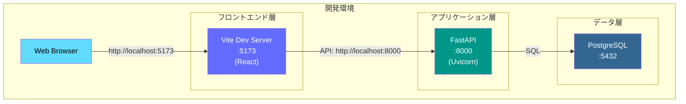
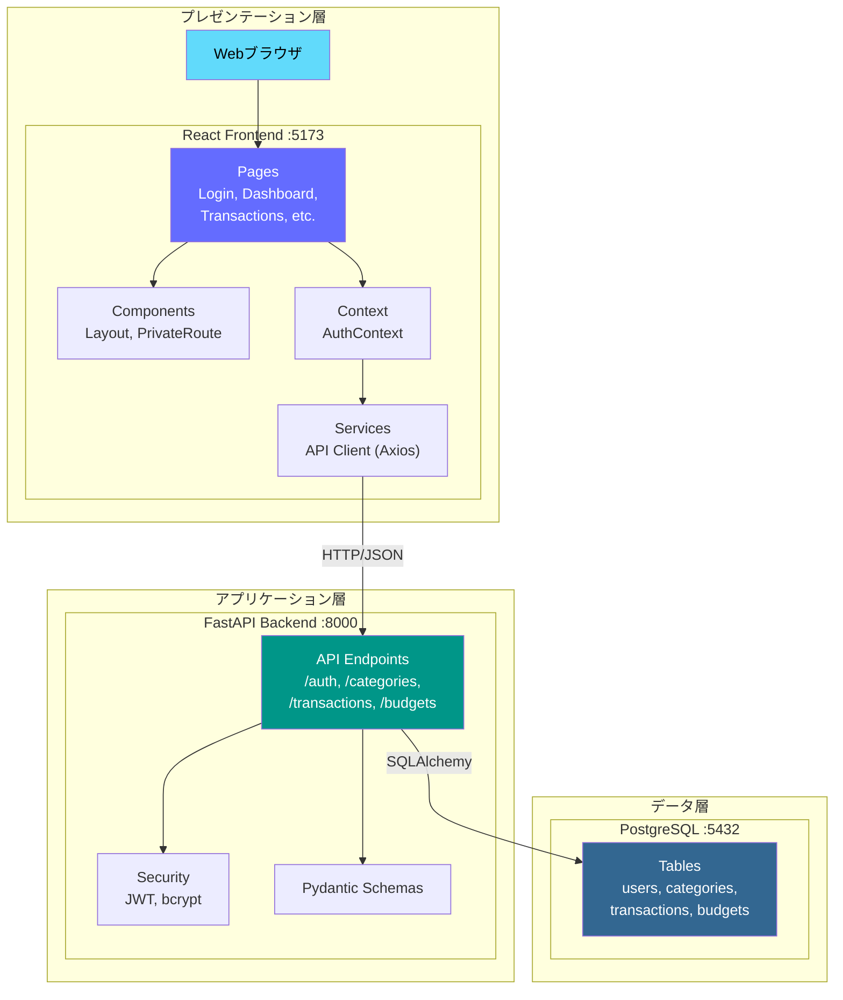
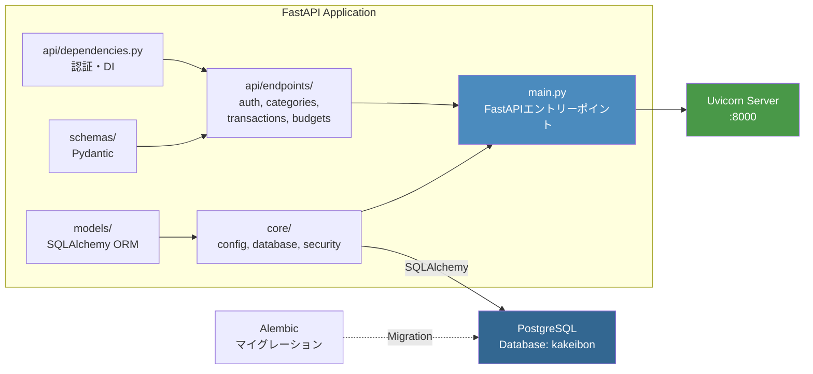
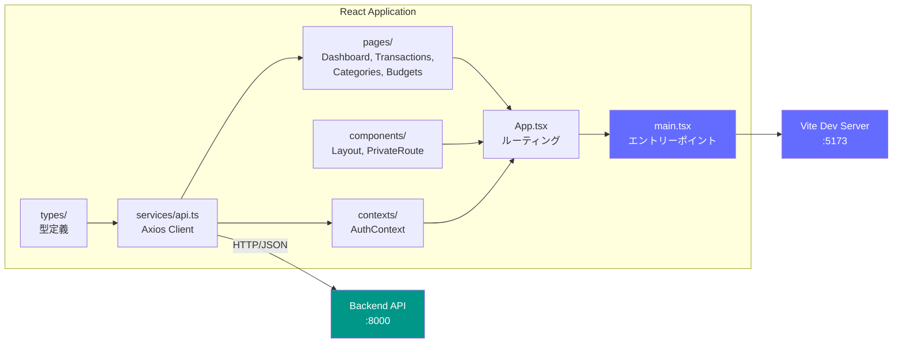
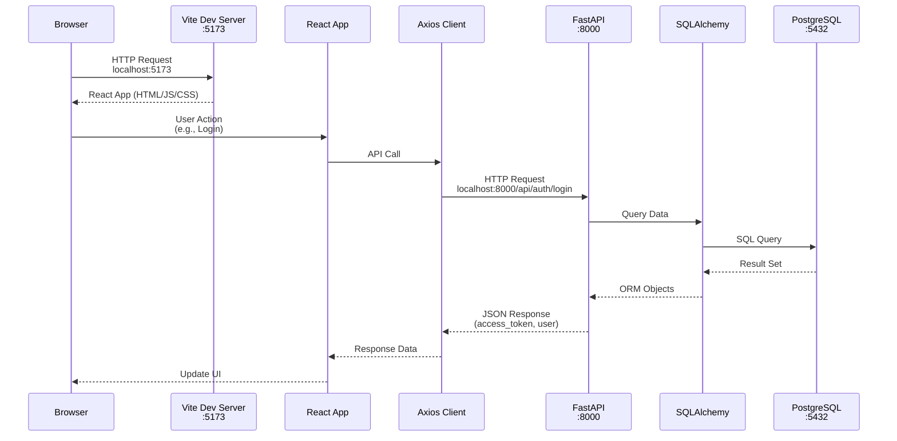
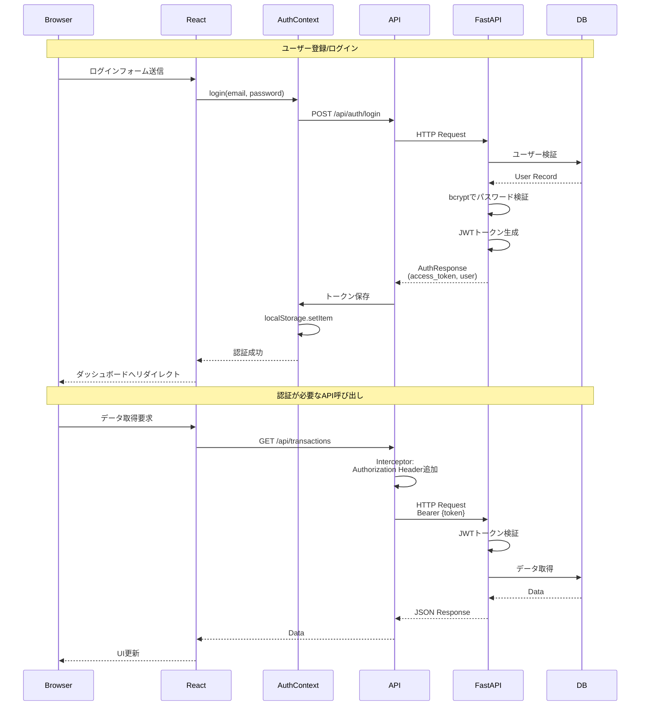
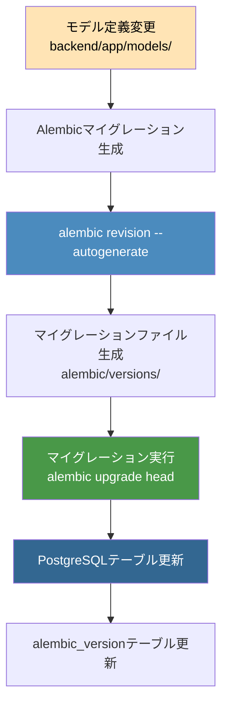
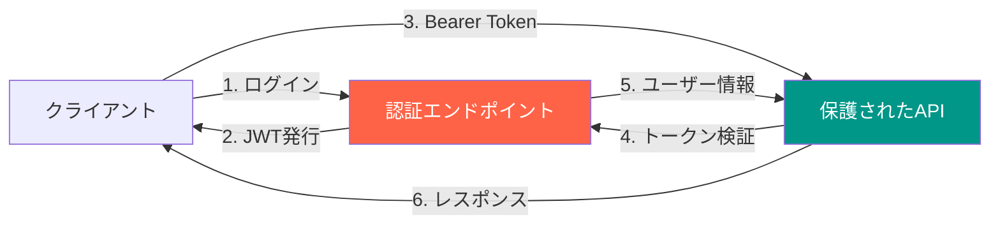
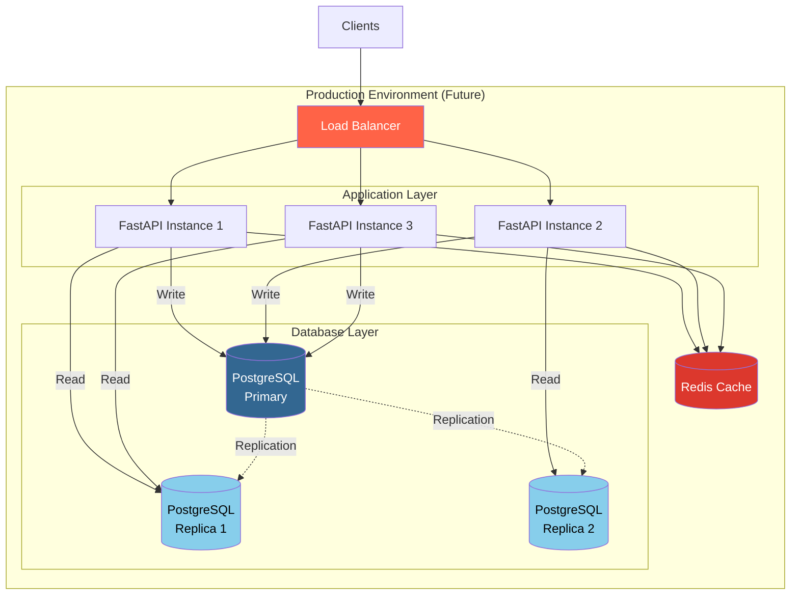

# システムアーキテクチャ

## システム全体構成

### 全体構成（3層アーキテクチャ）



### 3層構成の詳細



### アプリケーション構成詳細

#### バックエンド構成



#### フロントエンド構成



### ネットワーク通信フロー



### 認証フロー（JWT）



### データベースマイグレーションフロー



## ポート構成

| サービス | ポート | 用途 |
|---------|-------|------|
| PostgreSQL | 5432 | データベース接続 |
| FastAPI/Uvicorn | 8000 | REST API サーバー |
| Vite Dev Server | 5173 | フロントエンド開発サーバー |

## 接続情報まとめ

### データベース接続

```bash
# ローカル開発環境
Host: localhost
Port: 5432
Database: kakeibon
User: postgres
Password: password

# WSL2コンテナ環境から接続する場合
Host: host.docker.internal
Port: 5432
```

### アプリケーションURL

```
フロントエンド:
  http://localhost:5173

バックエンドAPI:
  http://localhost:8000
  http://localhost:8000/docs (Swagger UI)
  http://localhost:8000/redoc (ReDoc)

APIエンドポイント:
  Base URL: http://localhost:8000/api
  - /api/auth (register, login, me)
  - /api/categories (CRUD)
  - /api/transactions (CRUD + フィルタ)
  - /api/budgets (CRUD + フィルタ)
```

## セキュリティ考慮事項

### 認証・認可



**実装されているセキュリティ機能**:
- JWT (JSON Web Token) による認証
- bcrypt によるパスワードハッシュ化
- CORS 設定 (localhost:3000, localhost:5173 のみ許可)
- 環境変数による機密情報管理 (.env ファイル)
- 所有者チェック (ユーザーは自分のリソースのみ操作可能)

**本番環境での注意事項**:
- SECRET_KEY を強力なランダム文字列に変更
- PostgreSQL を外部公開しない（アプリケーションからのみアクセス可能に）
- HTTPS を必須化
- CORS 設定を本番ドメインのみに制限
- レート制限の実装
- 定期的なセキュリティアップデート

## スケーリング構成（将来）



現在は開発環境のため、単一のPostgreSQLインスタンスとFastAPIインスタンスで構成されていますが、
本番環境では上図のようなスケーラブルな構成を検討できます。
