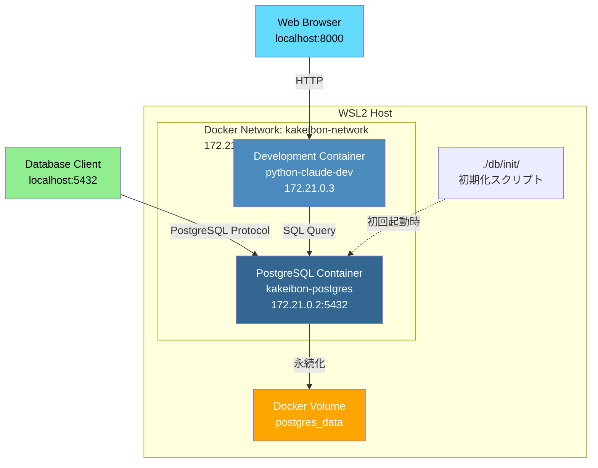
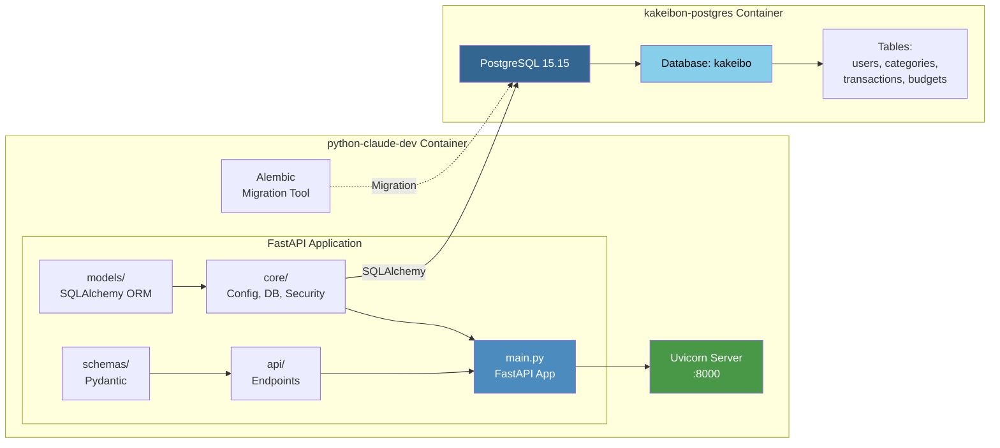
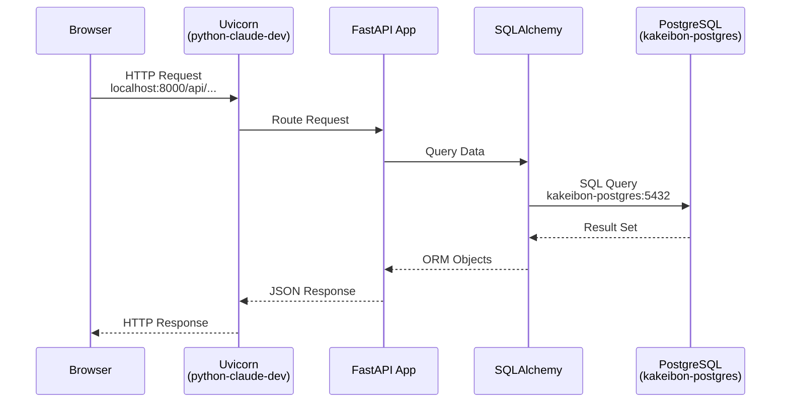
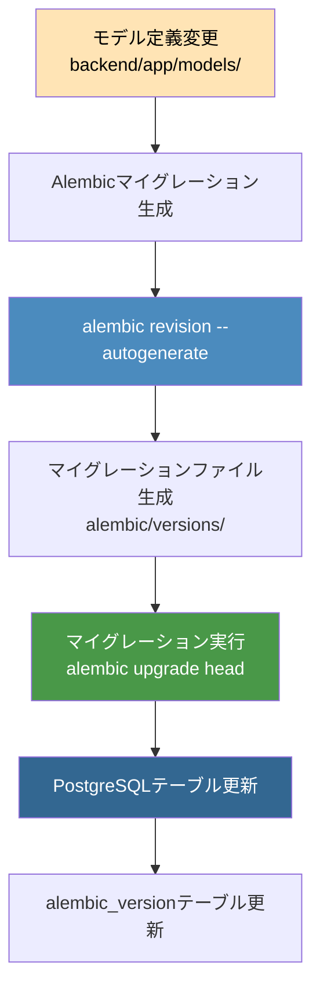
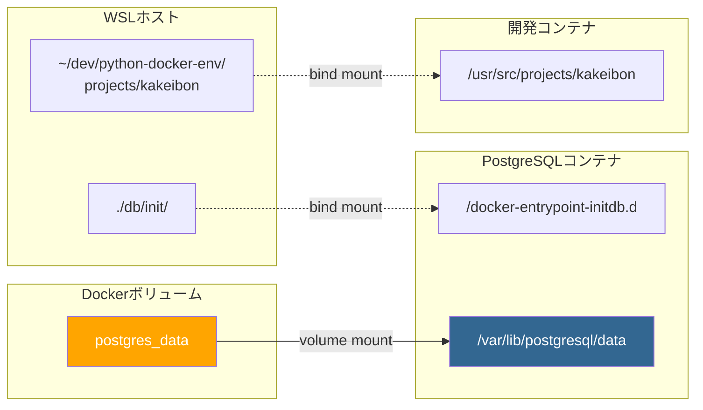
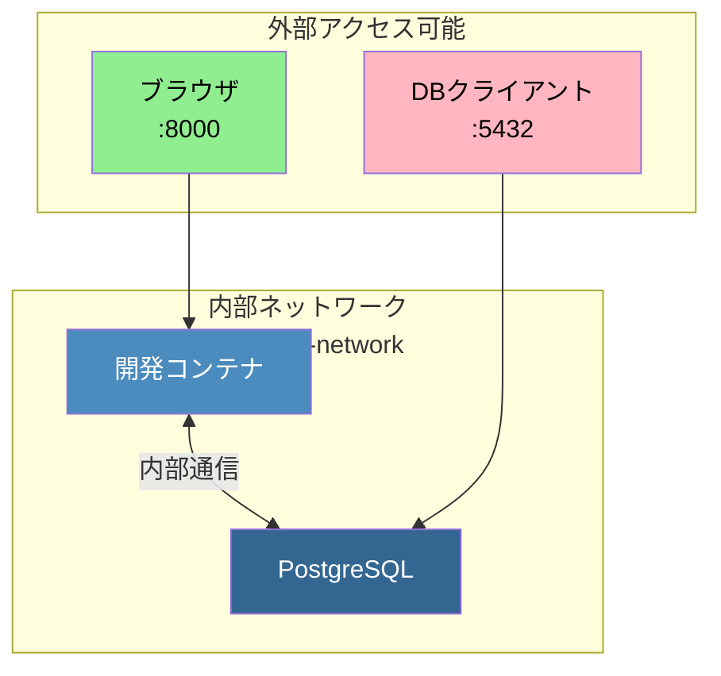
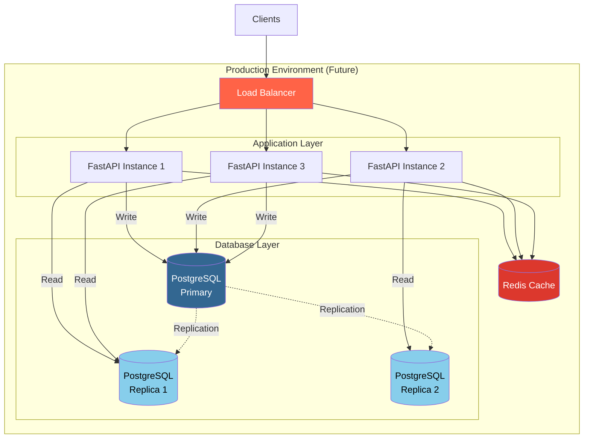

# システムアーキテクチャ

## Docker構成図

### 全体構成



### コンテナ詳細構成



### ネットワーク通信フロー



### データベースマイグレーションフロー



## ポート構成

| サービス | コンテナ内ポート | ホスト公開ポート | 用途 |
|---------|----------------|-----------------|------|
| PostgreSQL | 5432 | 5432 | データベース接続 |
| FastAPI/Uvicorn | 8000 | 8000 | API/Webサーバー |

## ボリュームマウント



## 接続情報まとめ

### コンテナ間通信（内部ネットワーク）

```
開発コンテナ → PostgreSQL
  Host: kakeibon-postgres
  Port: 5432
  Network: kakeibon-network (172.21.0.0/16)
```

### WSLホスト → PostgreSQL

```
WSLホスト → PostgreSQL
  Host: localhost
  Port: 5432
  接続: ポートフォワーディング経由
```

### ブラウザ → FastAPI

```
ブラウザ → FastAPI
  URL: http://localhost:8000
  Swagger UI: http://localhost:8000/docs
```

## セキュリティ考慮事項

### ネットワーク分離



**重要**:
- PostgreSQLは外部にポート公開されていますが、本番環境では非公開にすべきです
- 開発環境でのみポートを公開し、本番環境では内部ネットワークのみで通信します
- 認証情報（パスワード、SECRET_KEY）は必ず環境変数で管理し、.envファイルをgitignoreに追加済みです

## スケーリング構成（将来）



現在は開発環境のため、単一のPostgreSQLインスタンスとFastAPIインスタンスで構成されていますが、
本番環境では上図のようなスケーラブルな構成を検討できます。
